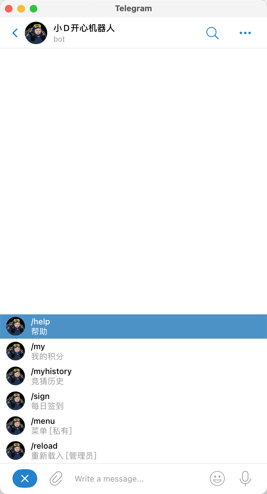
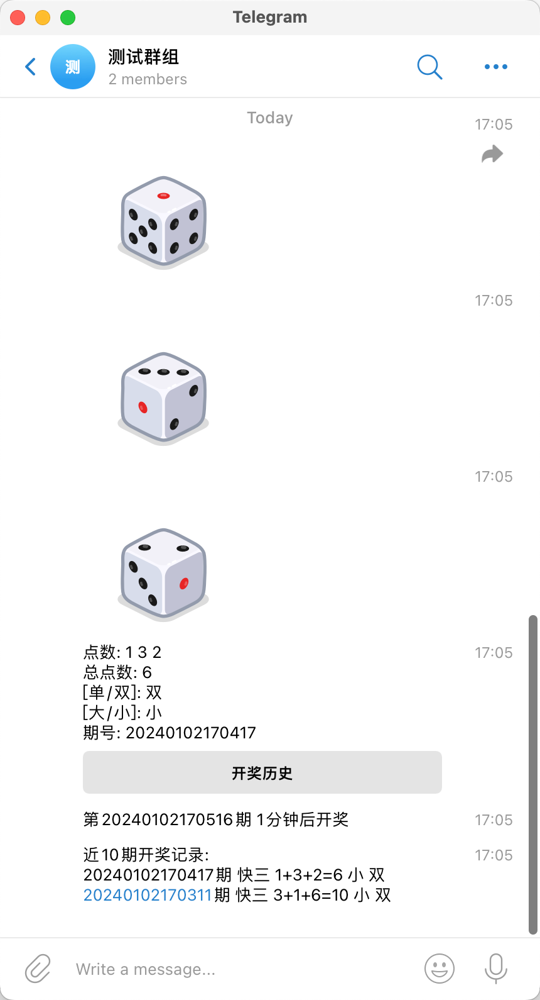
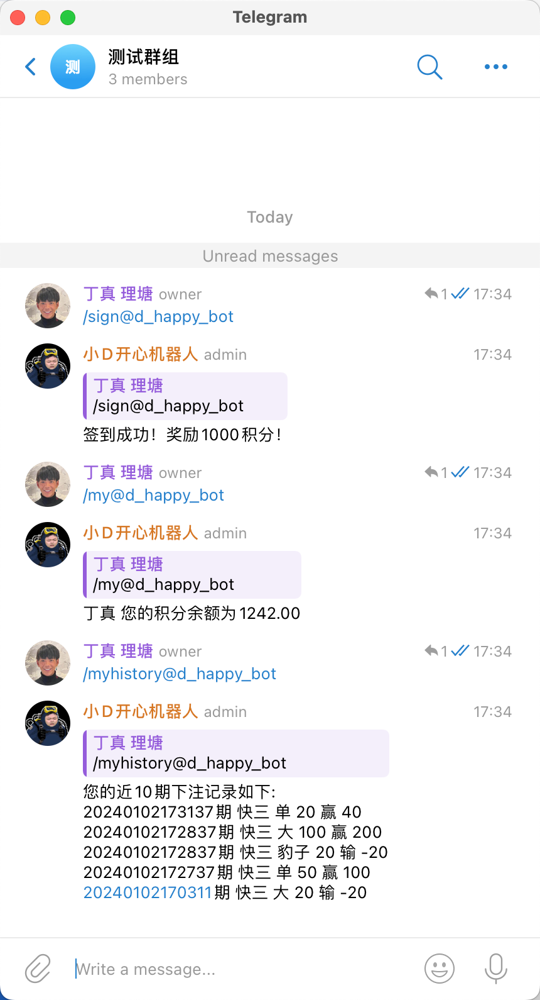
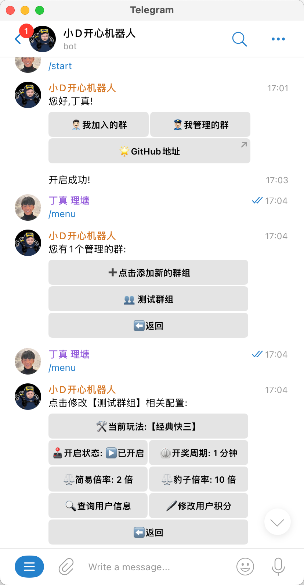
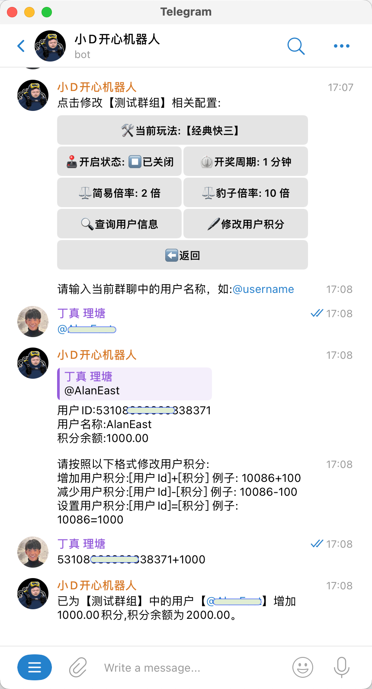
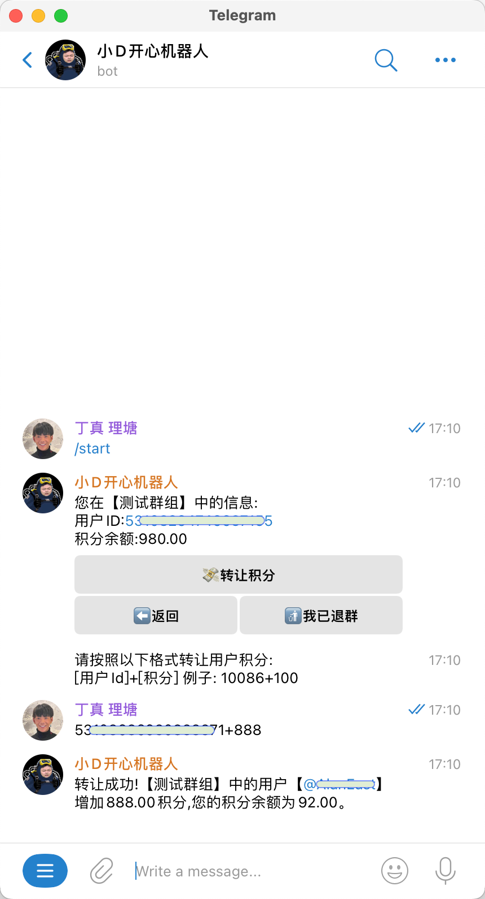

<div align="center">

# telegram-dice-bot

_免费且开源的Telegram骰子娱乐机器人_

_觉得有点意思的话 别忘了点个🌟_

🔨<a href="https://t.me/d_happy_bot" style="font-size: 20px;">点击使用TelegramBot</a>
或
👥<a href="https://t.me/+HOSNzxTdUnIxNjdl" style="font-size: 20px;">点击进入TG群体验</a>

目前项目迭代频繁、可能会有很多bug，所以🐞<a href="https://t.me/+cKR_eZoaCrdhOTRl" style="font-size: 20px;">此群组提交Bug</a>

</div>

## 功能

1. 内置多种游戏类型[经典快三...]
2. 游戏配置个性化修改[游戏开关、开奖时间、倍率调整...]
3. 开奖历史查询
4. 用户积分系统(群组隔离)
5. 用户积分转让(群组隔离)
6. 管理员积分调整(群组隔离)
7. 参与开奖结果通知(用户必须启用机器人)
8. 用户积分变更通知(用户必须启用机器人)
9. 每日签到奖励
10. 机器人交互白名单 

...

*[TG联系](https://t.me/alaneast)可代部署/定制化*


### Bot命令

```
/help                帮助
/register            用户注册
/sign                用户签到
/my                  查询积分
/myhistory           查询历史下注记录

默认开奖周期: 1分钟

【经典快三】
玩法例子(竞猜类型-单,下注金额-20): 
#单 20
支持竞猜类型: 单、双、大、小、豹子
```

### 功能示例(部分)
<span></span>
<span></span>
<span></span>
<br>
<span></span>
<span></span>
<span></span>
<br>

## 部署 

### 基于 Docker-Compose(All In One) 进行部署

```shell
docker-compose pull && docker-compose up -d
```

#### docker-compose.yml

```docker
version: '3.4'

services:
  telegram-dice-bot:
    image: deanxv/telegram-dice-bot:latest
    container_name: telegram-dice-bot
    restart: always
    volumes:
      - ./data/telegram-dice-bot:/data
    environment:
      - MYSQL_DSN=telegram-dice-bot:123456@tcp(db:3306)/telegram_dice_bot  # 可修改此行 SQL连接信息
      - REDIS_CONN_STRING=redis://redis
      - TZ=Asia/Shanghai
      - TELEGRAM_API_TOKEN=6830xxxxxxxxxxxxxxxx3GawBHc7ywDuU  # 必须修改此行telegram-bot的token
#      - WHITE_LIST=   # [可选]白名单 以@开头的用户名 比如@UserName
    depends_on:
      - redis
      - db

  redis:
    image: redis:latest
    container_name: redis
    restart: always

  db:
    image: mysql:8.2.0
    restart: always
    container_name: mysql
    volumes:
      - ./data/mysql:/var/lib/mysql  # 挂载目录，持久化存储
    ports:
      - '3306:3306'
    environment:
      TZ: Asia/Shanghai   # 可修改默认时区
      MYSQL_ROOT_PASSWORD: 'root@123456' # 可修改此行 root用户名 密码
      MYSQL_USER: telegram-dice-bot   # 可修改初始化专用用户用户名
      MYSQL_PASSWORD: '123456'    # 可修改初始化专用用户密码
      MYSQL_DATABASE: telegram_dice_bot   # 可修改初始化专用数据库
```

### 基于 Docker 进行部署

```shell
docker run --name telegram-dice-bot -d --restart always \
-e MYSQL_DSN="root:123456@tcp(localhost:3306)/telegram_dice_bot" \
-e REDIS_CONN_STRING="redis://default:<password>@<addr>:<port>" \
-e TELEGRAM_API_TOKEN="683091xxxxxxxxxxxxxxxxywDuU" \
deanxv/telegram-dice-bot
```

其中，`MYSQL_DSN`,`REDIS_CONN_STRING`,`TELEGRAM_API_TOKEN`修改为自己的，Mysql中新建名为`telegram_dice_bot`的db。

如果上面的镜像无法拉取，可以尝试使用 GitHub 的 Docker 镜像，将上面的 `deanxv/telegram-dice-bot`
替换为 `ghcr.io/deanxv/telegram-dice-bot` 即可。

### 部署到第三方平台

<details>
<summary><strong>部署到 Zeabur</strong></summary>
<div>

> Zeabur 的服务器在国外，自动解决了网络的问题，同时免费的额度也足够个人使用

点击一键部署:

[](https://zeabur.com/templates/81HN7O?referralCode=deanxv)

**一键部署后 `MYSQL_DSN` `REDIS_CONN_STRING` `TELEGRAM_API_TOKEN`变量也需要替换！**

或手动部署:

1. 首先 **fork** 一份代码。
2. 进入 [Zeabur](https://zeabur.com?referralCode=deanxv)，使用github登录，进入控制台。
3. 新建一个 Project，在 Service -> Add Service 选择 prebuilt，选择 MySQL，并记下连接参数（用户名、密码、地址、端口）。
4. 新建一个 Project，在 Service -> Add Service 选择 prebuilt，选择 Redis，并记下连接参数（密码、地址、端口）。
5. 使用mysql视图化工具连接mysql，运行 ```create database `telegram_dice_bot` ``` 创建数据库。
6. 在 Service -> Add Service，选择 Git（第一次使用需要先授权），选择你 fork 的仓库。
7. Deploy 会自动开始，先取消。
8. 添加环境变量

   `MYSQL_DSN`:`<username>:<password>@tcp(<addr>:<port>)/telegram_dice_bot`

   `REDIS_CONN_STRING`:`redis://default:<password>@<addr>:<port>`

   `TELEGRAM_API_TOKEN`:`你的TG机器人的TOKEN`
   
   `WHITE_LIST`:`@UserName` [可选]白名单 以@开头的用户名 比如@UserName

   保存。
9. 选择 Redeploy。

</div>
</details>

## 配置

### 环境变量

1. `MYSQL_DSN：root:123456@tcp(localhost:3306)/telegram_dice_bot`
2. `REDIS_CONN_STRING：redis://default:<password>@<addr>:<port>`
3. `TELEGRAM_API_TOKEN：683091xxxxxxxxxxxxxxxxywDuU` 你的TG机器人的TOKEN
4. `WHITE_LIST`:`@UserName` [可选]白名单 以@开头的用户名,比如@UserName,多个可用`,`分隔，设置白名单后,机器人的主菜单只有白名单才可唤醒


## Telegram-Bot相关

### cmd

```
help - 帮助
my - 我的积分
myhistory - 竞猜历史
sign - 每日签到
menu - 菜单 [私有]
reload - 重新载入 [管理员]
```
